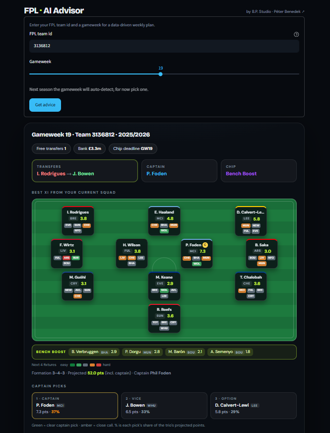
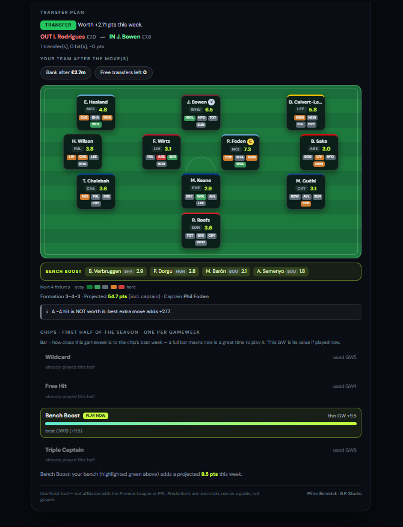

# FPL AI Advisor

A weekly decision aid for [Fantasy Premier League](https://fantasy.premierleague.com/).
Give it a team ID and a gameweek, and it recommends a **captain**, the best
**transfer(s)** (weighing form against upcoming fixtures, including whether a
−4 hit is worth taking), and **chip timing** for the Wildcard, Bench Boost,
Triple Captain and Free Hit — all driven by a points-prediction model and a
constrained squad optimiser, behind a Streamlit dashboard.

> **Unofficial.** Not affiliated with, endorsed by, or connected to the Premier
> League or Fantasy Premier League. Built for personal use and as a portfolio
> project.

> **Status.** The live demo runs on the completed 2025-26 season — enter a team
> ID and a past gameweek to see it in action. A live mode for the 2026-27 season
> (live predictions, player availability, automatic gameweek detection) is
> planned ahead of kickoff.

## What it does

- **Captain** — the highest projected scorer in your starting XI.
- **Transfers** — the swap (or swaps) that add the most projected points, with
  the hit math made explicit (a move is only urged when the gain clears the −4).
- **Best XI** — the optimal lineup and formation from your current 15.
- **Chip timing** — for each unused chip it finds its best week in the remaining
  half of the season, and only says *play now* when this week **is** that peak —
  so the headline call never contradicts the per-chip detail.

## Screenshots




## How it works

1. **Ingestion** — the public FPL API for live team state, and the community
   [vaastav/Fantasy-Premier-League](https://github.com/vaastav/Fantasy-Premier-League)
   dataset for per-gameweek history. Per-gameweek data is read through a
   configurable source (see *Data source* below).
2. **Features** — leakage-free rolling form (each stat shifted one game so a game
   never sees its own outcome), season-to-date form, minutes/starts trends,
   home/away, and opponent attack/defence strength as fixture difficulty.
3. **Model** — a two-stage expected-points model: `P(plays) × E[points | plays]`,
   each stage a LightGBM model. Splitting "will they play" from "how well" handles
   rotation and injuries-by-proxy better than a single regressor.
4. **Optimiser** — a single mixed-integer program (PuLP) that picks the 15-man
   squad, the starting XI and the captain to maximise projected points under the
   real rules: 2/5/5/3 by position, a valid formation, max three per club, and
   the budget.
5. **Advisor** — reconstructs your free-transfer count, runs the transfer/hit
   math, and applies the chip-timing logic above.
6. **Dashboard** — a Streamlit app that renders the pitch, the recommended moves,
   and the chip plan.

### Data source

Per-gameweek data is read through one switch, the `FPL_DATA_SOURCE` environment
variable, so the same code serves local development, the hosted demo and the
in-season live mode:

- **`db`** (default) — local Postgres, the historical dataset loaded by the
  ingestion scripts; used to train and backtest the model.
- **`csv`** — the vaastav CSVs pulled directly at runtime, no database; this is
  what the hosted demo uses.
- **`live`** — the live FPL API (current-gameweek detection and player
  availability), for in-season use in 2026-27; see `src/ingestion/live.py`.

## Model performance

Out-of-time backtest: trained on past seasons, evaluated on an unseen one
(2024-25). Lower MAE/RMSE is better; higher Spearman (rank correlation) is better.

| Model | MAE | RMSE | Spearman |
| --- | --- | --- | --- |
| **Two-stage + fixtures** (this project) | **1.050** | **2.069** | 0.696 |
| Baseline: last-3-game form | 1.105 | 2.235 | 0.702 |
| Reference: FPL's own expected points | 0.928 | 1.834 | 0.704 |

Read honestly: the model **beats the naive form baseline** on point error (MAE
and RMSE), while **FPL's own xP remains the strongest** — unsurprising, as it has
access to information this model doesn't (team news, confirmed lineups). Ranking
ability is close across all three. The advisor's edge isn't in out-predicting
FPL's internal model; it's in turning predictions into concrete, rules-aware
captain / transfer / chip decisions with the trade-offs shown.

Regenerate these numbers any time with `python -m src.model.model` (the
single-stage baseline is `python -m src.model.baseline`).

## Tech stack

Python · PostgreSQL (Docker) · pandas · LightGBM · scikit-learn · scipy · PuLP ·
Streamlit.

## Project structure

```
fpl-ai-advisor/
├── app.py                  # Streamlit dashboard
├── conftest.py             # makes `src` importable in tests
├── docker-compose.yml      # local Postgres service
├── requirements.txt
├── .env.example
├── models/                 # trained model (two_stage_v3.pkl included; retrain via python -m src.model.model)
├── src/
│   ├── config.py           # all constants in one place
│   ├── data/               # loaders: history (db / csv), team strengths
│   ├── db/                 # schema, connection, init
│   ├── ingestion/          # FPL API client, historical loader, live mode
│   ├── model/              # features, production model, baseline
│   ├── optim/              # squad / XI / captain optimiser
│   └── advisor/            # advice assembly + CLI
└── tests/                  # unit tests (no DB/model/network)
```

## Getting started

The dashboard reads per-gameweek data from a configurable source (the
`FPL_DATA_SOURCE` environment variable — see *Data source* above).

**Run without a database** (the quickest way to try it): create the virtual
environment and install dependencies (step 2 below), then:

```bash
FPL_DATA_SOURCE=csv streamlit run app.py
# Windows (PowerShell): $env:FPL_DATA_SOURCE="csv"; streamlit run app.py
```

For the full local setup with Postgres (used to train the model and ingest live
state), follow the steps below.

### Prerequisites

- **Python 3.11+**
- **Docker** (for the local Postgres container), or a native Postgres
- **Git**

### 1. Start the database

```bash
docker compose up -d db
```

### 2. Create a virtual environment and install dependencies

```bash
python -m venv .venv
source .venv/bin/activate        # Windows (PowerShell): .venv\Scripts\Activate.ps1
pip install -r requirements.txt
```

### 3. Configure the environment (optional)

The defaults already match the Docker service, so this is only needed if you
change the database settings:

```bash
cp .env.example .env             # Windows: copy .env.example .env
```

### 4. Create the tables

```bash
python -m src.db.init_db
```

### 5. Load historical data

Pulls per-gameweek history for the given seasons into Postgres (used to train and
backtest the model):

```bash
python -m src.ingestion.load_history 2022-23 2023-24 2024-25 2025-26
```

Optionally, to accumulate live current-season state (prices, ownership):

```bash
python -m src.ingestion.ingest_fpl
```

### 6. Train the model

```bash
python -m src.model.model
```

This trains the two-stage model, prints the backtest table above, and saves the
model to `models/`.

### 7. Run the dashboard

```bash
streamlit run app.py
```

Enter your FPL team ID and a gameweek to get advice.

## Command line

The advisor also runs without the dashboard:

```bash
python -m src.advisor.personal <team_id> <gameweek>
# e.g. python -m src.advisor.personal 3136812 16
```

## Tests

Unit tests cover the optimiser's constraints, the free-transfer estimate, and the
chip-timing logic. They use synthetic inputs and need no database, model or
network, so they run in seconds:

```bash
pytest -q
```

## Deployment

The hosted demo runs on Streamlit Community Cloud with **no database** — it reads
the season's data from the vaastav CSVs at runtime. Two settings on the host:

- environment variable `FPL_DATA_SOURCE=csv`
- (optional) an `app_password` secret to gate access to invited users

For the 2026-27 season, switching `FPL_DATA_SOURCE=live` moves the same app onto
the live FPL API — current-gameweek detection and player availability included —
with no other code change (see `src/ingestion/live.py`).

## Notes and limitations

- The model uses form, fixtures and home/away, but **not** live injury or
  suspension status (that data isn't available historically, so it can't be
  backtested honestly). The Wildcard logic is a reasonable proxy. The live mode
  incorporates the FPL availability flags (`status`, `chance_of_playing`), which
  should sharpen real-world advice.
- It projects your **current** squad forward, so it can't foresee future squad
  improvements from transfers — early-window chip peaks can read a little eager.
- FPL has high inherent variance. The aim is systematically better-than-gut
  decisions with honest uncertainty, not a crystal ball.
- The community history dataset lags the live season by a few gameweeks.

## License & data

Code released under the [MIT License](LICENSE).

Historical gameweek data comes from the
[vaastav/Fantasy-Premier-League](https://github.com/vaastav/Fantasy-Premier-League)
dataset (MIT licensed), and live data from the official FPL API. This project is
unaffiliated with the Premier League / Fantasy Premier League and does not
redistribute their data — it is fetched at runtime.

## Author

Built by **Péter Benedek** — B.P. Studio
[Portfolio](https://benedekpeter.netlify.app/) · [GitHub](https://github.com/benedekpepe) · [LinkedIn](https://www.linkedin.com/in/benedek-d-peter/)
