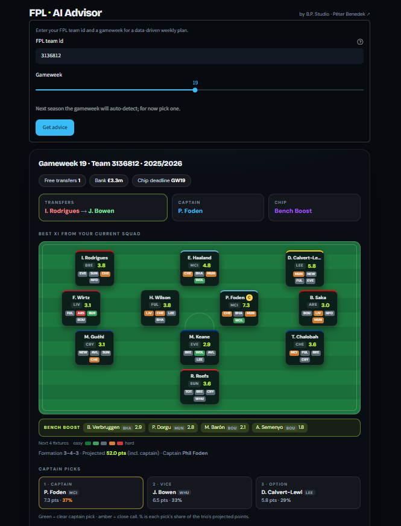
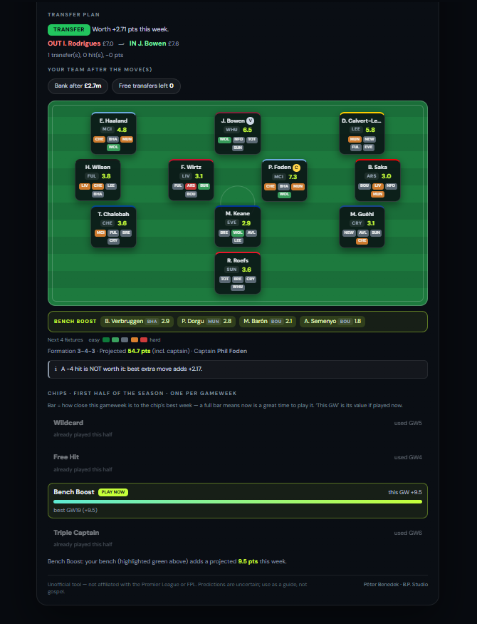

# FPL AI Advisor

[](https://github.com/benedekpepe/fpl-ai-advisor/actions/workflows/ci.yml)

**Live demo: https://fpl-ai-advisor.streamlit.app/**

A decision aid for [Fantasy Premier League](https://fantasy.premierleague.com/).
Before the season starts it **builds your opening squad from scratch**; once
gameweeks are played it advises the best **captain**, **transfer(s)** (weighing
form against fixtures, including whether a −4 hit is worth taking) and **chip
timing** — all driven by a points-prediction model and a constrained,
stack-aware squad optimiser, behind a Streamlit dashboard.

> **Unofficial.** Not affiliated with, endorsed by, or connected to the Premier
> League or Fantasy Premier League. Built for personal use and as a portfolio
> project.

> **Status.** Runs live for the 2026-27 season (`FPL_DATA_SOURCE=live`): before
> gameweek 1 it shows the **squad builder**; once a gameweek is played it
> switches to **weekly advice** on your team — the app detects which from the
> live gameweek. A finished-season **demo** (2025-26) is also available
> (`FPL_DATA_SOURCE=csv`), where you can try the advisor on any team ID and a
> past gameweek.

## Two modes

- **Squad builder** — the optimal 15-man squad built from scratch: for the start
  of the season (before any gameweek), or any time you want a from-scratch team
  for a Wildcard or Free Hit. Optionally **pin** must-have players, tick **Bench
  Boost** to build all 15 as strong GW1 picks, and see each pick's upcoming
  fixtures. Every player shows both its **this-gameweek** projection and its
  **next-4-average**. When there's no current-season form yet, projections are
  **seeded from last season**.
- **Weekly advice** — once the season is underway (the first deadline has
  passed): captain, transfer(s) with the hit math, best XI, and chip timing for
  the **upcoming** gameweek (the one you can still change), computed from your
  current squad.

## What it does

- **Squad builder** — the best legal 15 (2/5/5/3, valid formation, ≤ 3 per club,
  budget), with the starting XI, captain, optional pinned picks, and each
  player's upcoming fixtures shown on the pitch.
- **Captain** — the highest projected scorer in your starting XI.
- **Transfers** — the swap(s) that add the most projected points, with the hit
  math made explicit (a move is only urged when the gain clears the −4).
- **Best XI** — the optimal lineup and formation from your current 15.
- **Chip timing** — for each unused chip it finds its best week in the remaining
  half of the season, and only says *play now* when this week **is** that peak.
- **Availability-aware** — injured, suspended or loaned-out players are excluded
  from selection, benched if you own them, become transfer-out candidates, and
  are never recommended as buys; any injured or doubtful players in your own
  squad are also flagged at the top of the weekly advice.
- **Stack-aware** — it won't start (or transfer in) two players who face each
  other with opposed point sources — an attacker against a defender/keeper — so
  you don't pick both sides of the same match.

## Screenshots




## How it works

1. **Ingestion** — the public FPL API for live team state, prices, fixtures and
   availability, and the community
   [vaastav/Fantasy-Premier-League](https://github.com/vaastav/Fantasy-Premier-League)
   dataset for per-gameweek history. Per-gameweek data is read through a
   configurable source (see *Data source* below).
2. **Features** — leakage-free rolling form (each stat shifted one game so a game
   never sees its own outcome), season-to-date form, minutes/starts trends,
   home/away, and opponent attack/defence strength as fixture difficulty.
3. **Model** — a two-stage expected-points model: `P(plays) × E[points | plays]`,
   each stage a LightGBM model. Splitting "will they play" from "how well" handles
   rotation better than a single regressor.
4. **Cold start** — before any gameweek there is no current-season form, so each
   player's form is seeded from their **previous-season** per-game averages,
   joined to this season's players by their permanent FPL `code` (ids change
   between seasons). Players with no previous-season data (new signings, promoted
   clubs, youth) get a position + price based estimate; players whose permanent code
   didn't carry between seasons are recovered by name. The builder blends the next few
   gameweeks so upcoming fixtures matter, picks the 15 for that run, and then
   sets the starting XI on the immediate gameweek.
5. **Optimiser** — a mixed-integer program (PuLP) that picks the 15-man squad,
   the starting XI and the captain to maximise projected points (captain counted
   twice) under the real rules, with an optional **stack-aware** penalty that
   discourages starting opposing players from the same match. The same engine
   powers the builder, the best-XI choice and the transfer planner.
6. **Advisor** — reconstructs your free-transfer count, applies live availability,
   runs the transfer/hit math (stack-aware) and the chip-timing logic.
7. **Dashboard** — a Streamlit app that renders the pitch, the recommended moves
   and the chip plan, and shows the right mode for where the season is.

### Data source

Per-gameweek data is read through one switch, the `FPL_DATA_SOURCE` environment
variable, so the same code serves local development, the hosted demo and the
in-season live mode:

- **`db`** (default) — local Postgres, the historical dataset loaded by the
  ingestion scripts; used to train and backtest the model.
- **`csv`** — the vaastav CSVs pulled directly at runtime, no database; this is
  what the finished-season demo uses (2025-26).
- **`live`** — the live FPL API (2026-27): current-gameweek detection, player
  availability and the squad builder; see `src/ingestion/live.py` and
  `src/model/preseason.py`.

## Model performance

Out-of-time backtest: trained on past seasons, evaluated on an unseen one
(2024-25). Lower MAE/RMSE is better; higher Spearman (rank correlation) is better.

| Model | MAE | RMSE | Spearman |
| --- | --- | --- | --- |
| **Two-stage + fixtures** (this project) | **1.050** | **2.069** | 0.696 |
| Baseline: last-3-game form | 1.105 | 2.235 | 0.702 |
| Reference: FPL's own expected points | 0.928 | 1.834 | 0.704 |

Read honestly: the model **beats the naive form baseline** on point error (MAE
and RMSE), while **FPL's own xP remains the strongest** — unsurprising, as it has
access to information this model doesn't (team news, confirmed lineups). Ranking
ability is close across all three. The advisor's edge isn't in out-predicting
FPL's internal model; it's in turning predictions into concrete, rules-aware
squad / captain / transfer / chip decisions with the trade-offs shown.

Regenerate these numbers any time with `python -m src.model.model` (the
single-stage baseline is `python -m src.model.baseline`).

## Tech stack

Python · PostgreSQL (Docker) · pandas · LightGBM · scikit-learn · scipy · PuLP ·
Streamlit.

## Project structure

```
fpl-ai-advisor/
├── app.py                  # Streamlit dashboard (auto-detects builder vs advice)
├── conftest.py             # makes `src` importable in tests
├── docker-compose.yml      # local Postgres service
├── requirements.txt
├── .env.example
├── models/                 # trained model (two_stage_v3.pkl included; retrain via python -m src.model.model)
├── src/
│   ├── config.py           # all constants in one place
│   ├── data/               # loaders: history (db / csv), team strengths
│   ├── db/                 # schema, connection, init
│   ├── ingestion/          # FPL API client, historical loader, live mode
│   ├── model/              # features, model, baseline, pre-season cold start
│   ├── optim/              # stack-aware squad / XI / captain optimiser
│   └── advisor/            # advice assembly + CLI
└── tests/                  # unit tests (no DB/model/network)
```

## Getting started

The app reads per-gameweek data from a configurable source (the
`FPL_DATA_SOURCE` environment variable — see *Data source* above).

**Try it without a database.** Create the virtual environment and install
dependencies (step 2 below), then run either mode:

```bash
# Finished-season demo (2025-26): enter a team ID + a past gameweek in the app
FPL_DATA_SOURCE=csv streamlit run app.py

# Live (2026-27): squad builder before GW1, weekly advice once a gameweek is played
FPL_DATA_SOURCE=live streamlit run app.py
# Windows (PowerShell): $env:FPL_DATA_SOURCE="live"; streamlit run app.py
```

For the full local setup with Postgres (used to train the model and ingest live
state), follow the steps below.

### Prerequisites

- **Python 3.11+**
- **Docker** (for the local Postgres container), or a native Postgres
- **Git**

### 1. Start the database

```bash
docker compose up -d db
```

### 2. Create a virtual environment and install dependencies

```bash
python -m venv .venv
source .venv/bin/activate        # Windows (PowerShell): .venv\Scripts\Activate.ps1
pip install -r requirements.txt
```

### 3. Configure the environment (optional)

The defaults already match the Docker service, so this is only needed if you
change the database settings:

```bash
cp .env.example .env             # Windows: copy .env.example .env
```

### 4. Create the tables

```bash
python -m src.db.init_db
```

### 5. Load historical data

Pulls per-gameweek history for the given seasons into Postgres (used to train and
backtest the model):

```bash
python -m src.ingestion.load_history 2022-23 2023-24 2024-25 2025-26
```

### 6. Train the model

```bash
python -m src.model.model
```

This trains the two-stage model, prints the backtest table above, and saves the
model to `models/`.

### 7. Run the app

```bash
FPL_DATA_SOURCE=live streamlit run app.py
```

## Command line

Build an opening squad for the upcoming (unplayed) gameweek from the live API,
seeded from last season — optionally pinning must-have players:

```bash
python -m src.model.preseason               # optimal opening squad
python -m src.model.preseason --pin Haaland # force a must-have pick
```

The in-season advisor also runs without the dashboard:

```bash
python -m src.advisor.personal <team_id> <gameweek>
# e.g. python -m src.advisor.personal 1234567 16
```

## Tests

Unit tests cover the optimiser's constraints, the free-transfer estimate, and the
chip-timing logic. They use synthetic inputs and need no database, model or
network, so they run in seconds:

```bash
pytest -q
```

They also run automatically on every push and pull request via GitHub Actions
(Python 3.11 and 3.12) — see the CI badge at the top.

## Deployment

The app runs on Streamlit Community Cloud with **no database**. One setting on
the host decides what it is:

- `FPL_DATA_SOURCE=live` — the live 2026-27 tool: squad builder before GW1,
  weekly advice once gameweeks are played.
- `FPL_DATA_SOURCE=csv` — the finished-season demo (2025-26), reading the vaastav
  CSVs at runtime; anyone can try the advisor with a team ID and a past gameweek.

An optional `app_password` secret can gate access to invited users.

## Notes and limitations

- **Cold start.** Before any gameweek there's no current-season form, so early
  projections are seeded from last season and are correspondingly uncertain; the
  seed also compresses the gap between elite and mid-price players, so premiums
  and captaincy calls are worth your own judgement (that's what `--pin` is for).
- **Availability** comes from the live API (`status`, `chance_of_playing`), so it
  is only applied in live mode, not in the finished-season demo.
- It projects your **current** squad forward, so it can't foresee future squad
  improvements from transfers — early-window chip peaks can read a little eager.
- FPL has high inherent variance. The aim is systematically better-than-gut
  decisions with honest uncertainty, not a crystal ball.

## License & data

Code released under the [MIT License](LICENSE).

Historical gameweek data comes from the
[vaastav/Fantasy-Premier-League](https://github.com/vaastav/Fantasy-Premier-League)
dataset (MIT licensed), and live data from the official FPL API. This project is
unaffiliated with the Premier League / Fantasy Premier League and does not
redistribute their data — it is fetched at runtime.

## Author

Built by **Péter Benedek** — B.P. Studio
[Portfolio](https://benedekpeter.netlify.app/) · [GitHub](https://github.com/benedekpepe) · [LinkedIn](https://www.linkedin.com/in/benedek-d-peter/)
